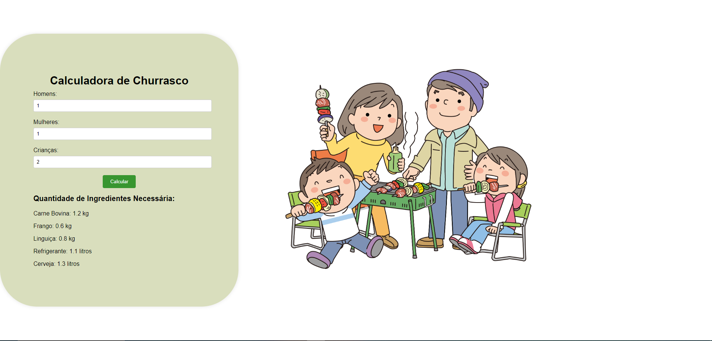

# Calculadora de Churrasco

Uma página web simples para calcular a quantidade de ingredientes necessária para um churrasco, de acordo com o número de pessoas participantes. A página calcula a quantidade de carne bovina, frango, linguiça, refrigerante e cerveja necessária com base no número de homens, mulheres e crianças.

## Estrutura do Projeto

O projeto é composto pelos seguintes arquivos:

- `index.html`: Contém a estrutura HTML da página.
- `style.css`: Contém os estilos CSS para a formatação da página.
- `script.js`: Contém o código JavaScript para calcular e exibir os resultados.
- `Churrasco.png`: Imagem de fundo da página.
- `Screenshot.png`: Imagem da calculadora.

## Como Usar

1. **Clone o repositório ou baixe os arquivos zipados.**

2. **Abra o arquivo `index.html` em um navegador web.**

3. **Insira o número de homens, mulheres e crianças que participarão do churrasco.**

4. **Clique no botão "Calcular".**

5. **As quantidades necessárias de cada item serão exibidas abaixo do botão, com uma imagem de refrigerante ao lado do resultado do refrigerante.**

## Estimativas de Consumo

- **Carne bovina:**
  - Homens: 500g
  - Mulheres: 300g
  - Crianças: 200g

- **Frango:**
  - Homens: 200g
  - Mulheres: 200g
  - Crianças: 100g

- **Linguiça:**
  - Homens: 200g
  - Mulheres: 200g
  - Crianças: 200g

- **Refrigerante:**
  - Homens: 300ml
  - Mulheres: 400ml
  - Crianças: 200ml

- **Cerveja:**
  - Homens: 800ml
  - Mulheres: 500ml
  - Crianças: 0ml

## Customização

Você pode ajustar as estimativas de consumo diretamente no arquivo `script.js` se desejar modificar as quantidades por pessoa.

## Screenshot

## Tecnologias Utilizadas

- HTML
- CSS
- JavaScript

## Autor

Desenvolvido por [Seu Nome]. 

Sinta-se à vontade para contribuir ou fazer sugestões para melhorar esta ferramenta!
